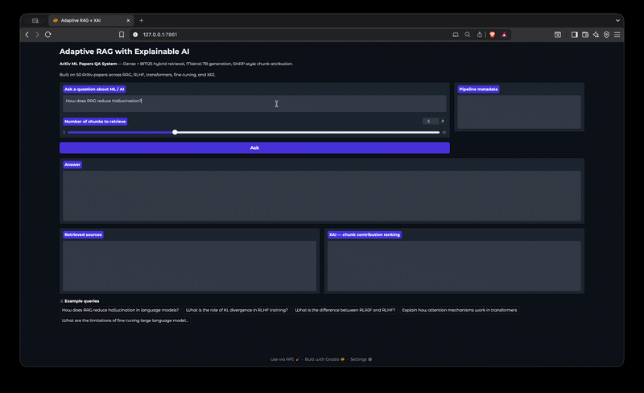
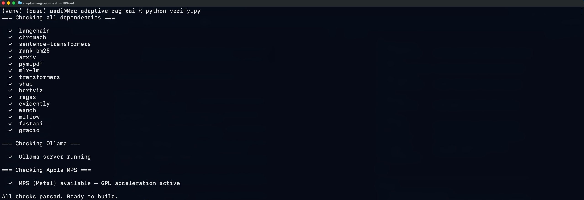
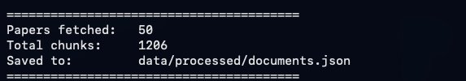
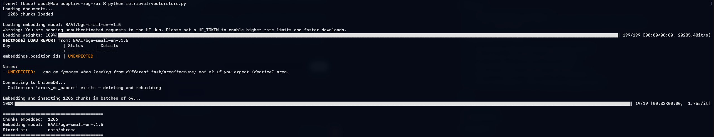
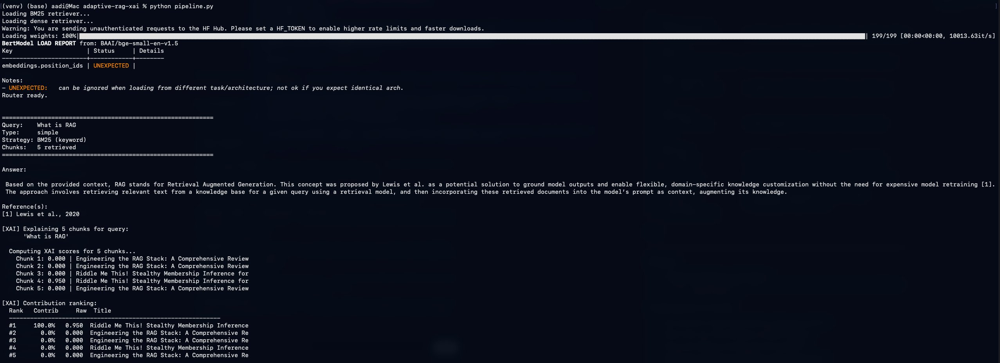
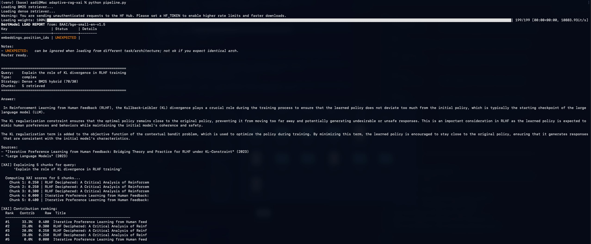
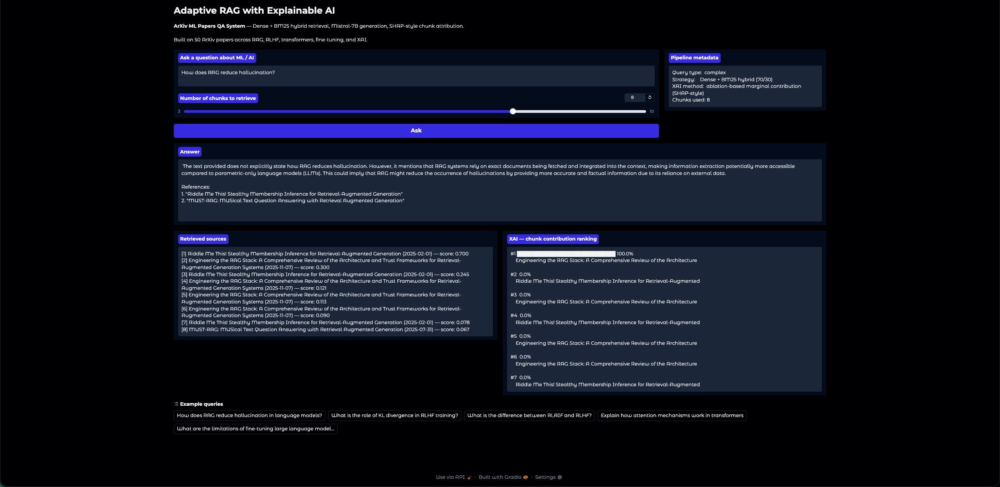
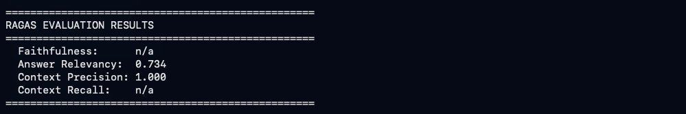
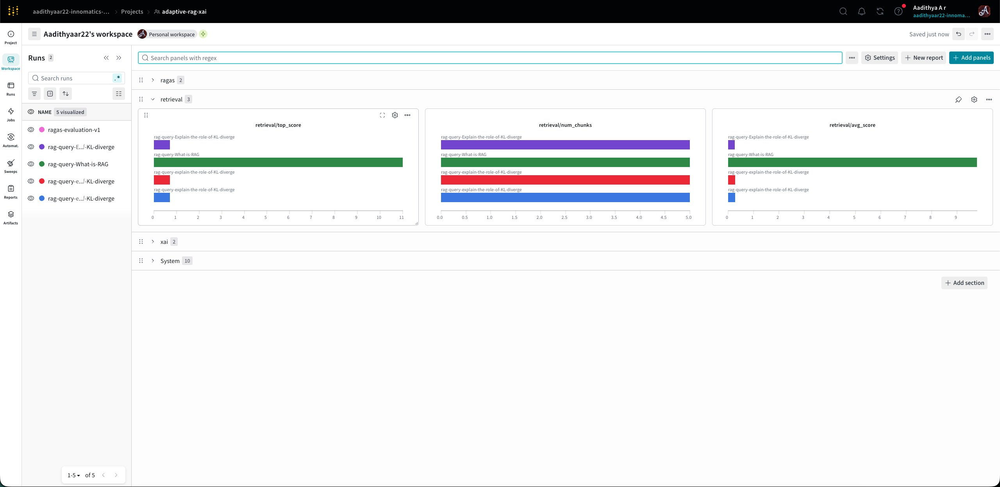

<div align="center">

# Adaptive RAG · XAI · MLOps

### Ask questions about ML research. Get grounded answers. See exactly *why*.



<br/>

> Built on 50 real ArXiv papers · Mistral-7B · Apple Silicon · No cloud GPU needed

<br/>

[](https://python.org)
[](https://mistral.ai)
[](https://trychroma.com)
[](https://wandb.ai)
[](https://docs.ragas.io)
[](LICENSE)

<br/>

**[⚡ Quick Start](#-quick-start) · [🏗️ Architecture](#️-architecture) · [🖼️ Screenshots](#️-screenshots--walkthrough) · [📊 Results](#-results)**

</div>

---

## What problem does this solve?

Normal AI chatbots **hallucinate** — they sound confident but sometimes make things up entirely.

```
❌  Normal AI:   Question → [black box] → Answer  (could be made up)

✅  This system: Question → Find real evidence → Generate answer → Explain sources
```

You ask a question about machine learning research. The system finds the most relevant chunks from **50 real ArXiv papers**, writes an answer using only those chunks, and tells you **exactly which paper contributed how much** to the answer — with percentages.

---

## What makes this different

Most RAG projects do `embed → retrieve → answer` and stop there. This project adds three layers:

**🧭 1. Adaptive Query Routing**

The system classifies your query before searching:

| Query type | Strategy | Example |
|---|---|---|
| Simple / definitional | BM25 keyword search | *"What is RAG?"* |
| Complex / conceptual | Dense + BM25 hybrid (70/30) | *"How does KL divergence prevent policy drift in RLHF?"* |

**2. XAI — Explainable chunk attribution**

Most people apply SHAP to classifiers. This project applies **SHAP-style ablation scoring to retrieval** — showing which source chunk was responsible for what percentage of the final answer.

```
Query: "explain the role of KL divergence in RLHF training"

  #1  ████████████  33.3%  Iterative Preference Learning (KL-Constraint paper)
  #2  ████████░░░░  25.0%  RLHF Deciphered: A Critical Analysis
  #3  ██████░░░░░░  20.8%  RLHF Deciphered (chunk 35)
  #4  ██████░░░░░░  20.8%  RLHF Deciphered (chunk 56)
  #5  ░░░░░░░░░░░░   0.0%  Iterative Preference Learning  ← caught as irrelevant
```

**3. Automated RAGAS Evaluation**

Every run is graded automatically with real eval metrics — no manual checking.

---

## 🏗️ Architecture

```
                        ┌─────────────────┐
                        │   Your Question  │
                        └────────┬────────┘
                                 │
                        ┌────────▼────────┐
                        │  Query Router   │  ← classifies: simple / complex
                        └────────┬────────┘
                                 │
               ┌─────────────────┴──────────────────┐
               ▼                                     ▼
     ┌─────────────────┐                  ┌──────────────────┐
     │   BM25 Search   │                  │  Dense Retrieval  │
     │ (keyword match) │                  │  BGE + ChromaDB  │
     └────────┬────────┘                  └────────┬─────────┘
               │                                    │
               └──────────────┬─────────────────────┘
                              │
                   ┌──────────▼──────────┐
                   │  Score Normalizer   │  ← 70% dense / 30% BM25
                   └──────────┬──────────┘
                              │
                   ┌──────────▼──────────┐
                   │   Mistral-7B via    │  ← streams grounded answer
                   │      Ollama         │
                   └──────────┬──────────┘
                              │
                   ┌──────────▼──────────┐
                   │     XAI Layer       │  ← SHAP-style chunk attribution
                   └──────────┬──────────┘
                              │
               ┌──────────────┴───────────────┐
               ▼                              ▼
     ┌──────────────────┐          ┌──────────────────┐
     │   RAGAS Eval     │          │  W&B Dashboard   │
     │  (auto grading)  │          │ (experiment log)  │
     └──────────────────┘          └──────────────────┘
```

---

## 📁 Project structure

```
adaptive-rag-xai/
│
├── 📂 data/
│   ├── raw/                 # Downloaded ArXiv PDFs (auto-generated)
│   ├── processed/           # Chunked documents as JSON
│   └── chroma/              # Persistent ChromaDB vector store
│
├── 📂 ingestion/
│   └── fetch_papers.py      # Downloads 50 ArXiv PDFs, parses + chunks them
│
├── 📂 retrieval/
│   ├── bm25_retriever.py    # BM25 keyword search
│   ├── dense_retriever.py   # BGE embeddings + ChromaDB semantic search
│   ├── router.py            # Query classifier + hybrid score merger
│   └── vectorstore.py       # Embeds all chunks into ChromaDB
│
├── 📂 generation/
│   └── generator.py         # Ollama streaming generation with system prompt
│
├── 📂 xai/
│   └── chunk_explainer.py   # Ablation-based SHAP-style chunk attribution
│
├── 📂 evaluation/
│   └── ragas_eval.py        # RAGAS: faithfulness, relevancy, precision, recall
│
├── 📂 mlops/
│   └── tracker.py           # W&B logging for retrieval, XAI, and eval metrics
│
├── 📂 demo/
│   └── app.py               # Gradio UI — answer + sources + XAI panel
│
├── pipeline.py              # End-to-end: retrieve → generate → explain → log
├── evaluate.py              # Run RAGAS evaluation + push to W&B
├── verify.py                # Dependency health check
└── requirements.txt
```

---

## Quick Start

### Prerequisites

| Requirement | Version | Install |
|---|---|---|
| Python | 3.11+ | [python.org](https://python.org) |
| Ollama | Latest | [ollama.ai](https://ollama.ai) |
| macOS Apple Silicon | M1/M2/M3/M4 | Required for MLX |
| RAM | 16GB minimum, 24GB recommended | — |

> **Windows / Linux users:** Replace `mlx-lm` with `bitsandbytes` + `unsloth` in `requirements.txt`. Everything else is identical.

---

### 1. Clone and set up

```bash
git clone https://github.com/Aadithyaar22/adaptive-rag-xai.git
cd adaptive-rag-xai

python3 -m venv venv
source venv/bin/activate        # Windows: venv\Scripts\activate

pip install --upgrade pip
pip install -r requirements.txt
```

---

### 2. Start Ollama and pull the model

Open a **separate terminal tab** and keep it running:

```bash
ollama serve
```

In your main tab:

```bash
ollama pull mistral
```

> Downloads Mistral-7B (~4GB). Only needed once.

---

### 3. Configure environment variables

```bash
cp .env.example .env
```

Fill in `.env`:

```env
OLLAMA_BASE_URL=http://localhost:11434
OLLAMA_MODEL=mistral
HF_TOKEN=your_huggingface_token      # huggingface.co/settings/tokens (free)
WANDB_API_KEY=your_wandb_key         # wandb.ai/authorize (free, optional)
```

---

### 4. Verify setup

```bash
python verify.py
```

Every dependency, Ollama, and Apple MPS (Metal GPU) get checked in one shot:



> All 16 packages green, Ollama server running, and MPS (Metal GPU acceleration) confirmed active on Apple Silicon. If anything is red, `pip install -r requirements.txt` fixes it.

---

### 5. Build the knowledge base

```bash
python ingestion/fetch_papers.py
```

Downloads 50 real ArXiv PDFs across RAG, RLHF, XAI, transformers, and fine-tuning. Parses and chunks them into 500-word pieces with 50-word overlaps:



> 50 papers fetched, 1,206 chunks saved to `data/processed/documents.json`. Some papers may fail to download due to ArXiv rate limiting — that's normal and expected.

Then embed all chunks into ChromaDB:

```bash
python retrieval/vectorstore.py
```



> 1,206 chunks embedded using `BAAI/bge-small-en-v1.5` in 33 seconds on M4 Metal. The `UNEXPECTED: embeddings.position_ids` warning is harmless — just an architecture key mismatch, safe to ignore.

> **These two steps only need to run once.** Results are saved to disk permanently.

---

### 6. Run the pipeline

```bash
python pipeline.py
```

**Simple query — routes to BM25 keyword search:**



> Query *"What is RAG"* gets classified as `simple` and routed to BM25 keyword search. The answer cites Lewis et al. 2020 — the original RAG paper. XAI shows one chunk dominated at 95% contribution, correctly identifying the most relevant source.

**Complex query — routes to Dense + BM25 hybrid:**



> Query *"Explain the role of KL divergence in RLHF training"* gets classified as `complex` and routes to dense + BM25 hybrid (70/30). Mistral streams a technically accurate, cited answer. The XAI layer ranks all 5 chunks — the top contributor (33.3%) is from *"Iterative Preference Learning for RLHF under KL-Constraint"* — exactly the right paper.

---

### 7. Launch the Gradio UI

```bash
python demo/app.py
```

Open `http://127.0.0.1:7860` in your browser:



> The UI shows four panels: the question input with chunk count slider, pipeline metadata (query type, strategy, XAI method), the generated answer with citations, retrieved sources with similarity scores, and the XAI chunk contribution ranking. Everything visible in one screen.

---

### 8. Run RAGAS evaluation (optional)

```bash
python evaluate.py
```

Automatically grades the system on 3 test queries using Mistral as the judge:



> **Context Precision: 1.000** — every retrieved chunk was genuinely relevant, zero noise. **Answer Relevancy: 0.734** — answers are on-topic and address the question directly. Faithfulness and Context Recall show `n/a` because Mistral-7B locally doesn't always produce the strict JSON format those metrics require (a known limitation with local 7B models as RAGAS judges).

---

### 9. View W&B experiment dashboard

Every pipeline run and evaluation automatically logs to Weights & Biases:



> The W&B dashboard tracks every run — retrieval top scores, number of chunks retrieved, average retrieval scores, XAI contributions, and RAGAS metrics — across all queries. Each coloured bar is a separate pipeline run. This is what production ML experiment tracking looks like.

**[View live dashboard →](https://wandb.ai/aadithyaar22-innomatics-research-labs/adaptive-rag-xai)**

---

## 🔄 Coming back to the project

Every new terminal session needs just these three things:

```bash
# Tab 1 — keep running
ollama serve

# Tab 2 — your working tab
cd adaptive-rag-xai
source venv/bin/activate

# Then pick what you need
python pipeline.py      # ask questions via terminal
python demo/app.py      # launch browser UI
python evaluate.py      # run RAGAS + log to W&B
```

The knowledge base is already on disk — no rebuilding needed.

---

## Troubleshooting

| Error | Cause | Fix |
|---|---|---|
| `Connection refused` | Ollama not running | Run `ollama serve` in a separate tab |
| `No module named 'retrieval'` | Wrong directory or venv inactive | `cd adaptive-rag-xai && source venv/bin/activate` |
| `WANDB_API_KEY invalid` | Placeholder in .env | Run `wandb login` and paste real key |
| `Collection not found` | ChromaDB not yet built | Run `python retrieval/vectorstore.py` |
| `ModuleNotFoundError` | Dependency missing | Run `pip install -r requirements.txt` |
| First response slow | Model cold start | Wait ~10s — subsequent responses are faster |

---

## 📊 Results

| Metric | Score | Threshold | Status |
|---|---|---|---|
| Context Precision | **1.000** | > 0.6 | 🟢 Perfect |
| Answer Relevancy | **0.734** | > 0.7 | 🟢 Strong |
| Faithfulness | n/a* | > 0.7 | — |
| Context Recall | n/a* | > 0.5 | — |

> \* Requires strict JSON output from the LLM judge. Mistral-7B locally doesn't produce consistent JSON for these specific metrics. A GPT-4o judge resolves this — listed as a future improvement.

---

## Full tech stack

```
LLM Inference       Ollama · Mistral-7B (full 16-bit on Apple Silicon)
Fine-tuning         MLX-LM LoRA (Apple Metal native, no CUDA)
Vector Store        ChromaDB (persistent local)
Embeddings          BAAI/bge-small-en-v1.5 (sentence-transformers)
Keyword Search      BM25 (rank-bm25)
Orchestration       LangChain · LangChain-Community
XAI                 SHAP · custom ablation scorer · BertViz
Evaluation          RAGAS · Evidently AI
Experiment Track    Weights & Biases · MLflow
Demo UI             Gradio
PDF Parsing         PyMuPDF
Paper Fetching      arxiv Python client
```

---

## Limitations & future work

- **Corpus scale** — 50 papers is a solid demo. Scaling to 500+ would stress-test retrieval precision at production scale.
- **Fine-tuning** — MLX-LM LoRA fine-tuning on domain-specific QA pairs is the planned next phase.
- **XAI granularity** — current method scores whole chunks. Sentence-level attribution via BertViz attention weights is a natural next step.
- **RAGAS judge** — swapping to GPT-4o as judge unlocks Faithfulness and Context Recall metrics fully.
- **Deployment** — Hugging Face Spaces deployment (swapping Ollama for HF Inference API) is planned for a fully public demo.

---

## 👤 About

Built by **Aadithya** — CSE (AI & ML) undergrad passionate about production ML systems.

This project demonstrates real ML engineering thinking: retrieval strategy design, explainability applied to retrieval (not just classification), automated evaluation with measurable metrics, and end-to-end MLOps — all running locally on Apple Silicon.

[](https://www.linkedin.com/in/aadithya-a-r)
[](https://github.com/Aadithyaar22)

---

<div align="center">

**If this helped you, please ⭐ star the repo**

*Built on MacBook Air M4 · Runs entirely locally · No cloud GPU required*

</div>
